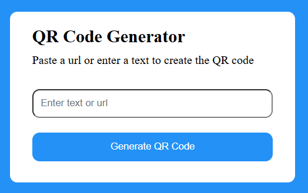
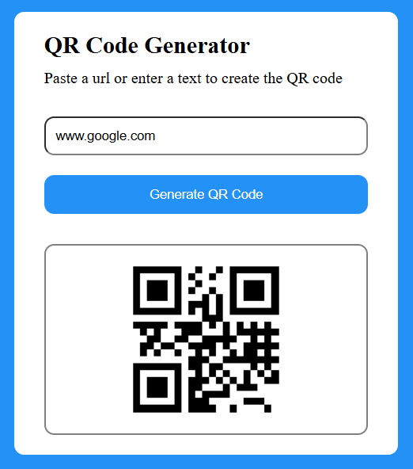

# QR-code-generator-

## You type something in the box, once the button is clicked, the related QR Code will be generated using the following site: https://api.qrserver.com/v1/create-qr-code/?size=150x150&data=Example

# 

# 

### The source code video: https://youtu.be/pv5K28zVepE?si=uGGj5K3c0oROTh5A 